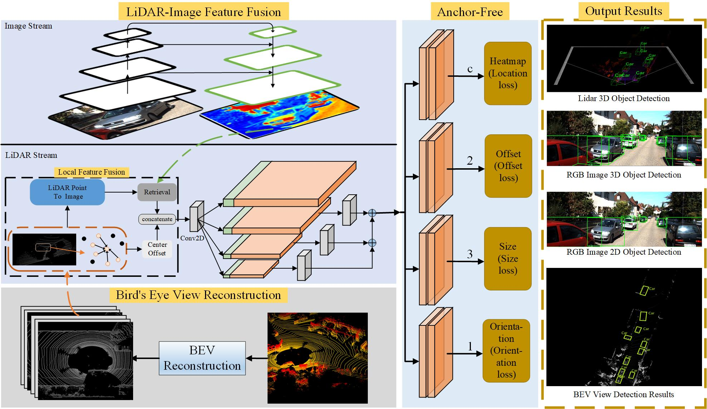

# Anchor-free 3D Object Detection using Multimodal Fusion

### Overall structure diagram of the method

### Method of ablation experiment results
| Method   |         |     |     |     | Modality |   | 3D Detection(Car) |       |       | Metric |
|----------|---------|-----|-----|-----|----------|---|-------------------|-------|-------|--------|
| Baseline | BEV_Res | MMF | k=5 | k=1 | C        | L | Easy              | Mod   | Hard  | IoU    |
| √        |         |     |     |     | √        |   | 50.01             | 40.35 | 32.01 | 0.5    |
| √        |         |     |     |     | √        |   | 18.13             | 14.63 | 13.89 | 0.7    |
| √        |         |     |     |     |          | √ | -                 | -     | -     | 0.5    |
| √        |         |     |     |     |          | √ | 57.23             | 55.16 | 44.23 | 0.7    |
| √        |         | √   |     | √   | √        | √ | -                 | -     | -     | 0.7    |
| √        | √       | √   |     | √   | √        | √ | 73.12             | 64.64 | 58.88 | 0.7    |
| √        |         | √   | √   |     | √        | √ | 72.51             | 62.01 | 56.32 | 0.7    |
| √        | √       | √   | √   |     | √        | √ | 74.28             | 63.55 | 58.61 | 0.7    |

